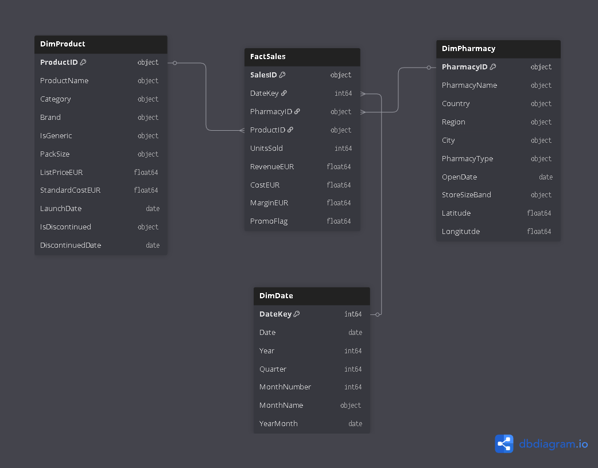

# European Pharmacy Sales & Profitability Report

**Overview**  

A European pharmacy distributor operates across multiple countries, managing hundreds of urban, suburban, and rural pharmacies. With thousands of daily transactions, the company faces challenges in understanding how geography, product mix, and promotions affect overall profitability. The dataset spans multiple dimensions — time, pharmacy, product, and sales transactions — enabling a comprehensive view of performance across the network. The analysis focuses on uncovering sales drivers, profitability patterns, and promotional impacts across different pharmacy types, product categories, and brands.  

**Executive Summary**
Using SQL for data exploration and Power BI for visualization, this analysis uncovers key drivers of sales and profitability.

**Key Findings:**

- Urban pharmacies consistently outperform rural ones in both sales volume and margin contribution.
- Prescription products dominate revenue share, while branded products outperform generics in overall sales.
- Gross margin averages 28% for both years (2024 & 2025), reflecting a competitive, high‑volume, low‑margin environment.
- Promotions boost unit sales but often compress margins, requiring careful targeting.
- Geographic analysis reveals regional disparities, with certain countries contributing disproportionately to total revenue.
- **Stakeholder Value:** Provides actionable insights into product mix, location strategy, and profitability levers.  

**Key Features**  
- **SQL Data Modeling:** Queries to calculate revenue, cost, margin, and category breakdowns.  
- **Power BI Dashboard:** Interactive visuals showing sales distribution, gross margin %, and promotional effects.   

**Deliverables**  
- SQL scripts for data exploration.  
- Power BI dashboard file (.pbix) for data extraction and transformation with interactive visuals.  
- Exported report (PDF/PNG) for quick stakeholder review.  

---

**Data**

#### **DimDate**
- `DateKey` – Unique key for each day  
- `Date` – Calendar date  
- `Year`, `Quarter`, `MonthNumber`, `MonthName`, `YearMonth` – Time attributes  

#### **DimPharmacy**
- `PharmacyID`, `PharmacyName` – Store identifiers  
- `Country`, `Region`, `City` – Geographic attributes  
- `PharmacyType` – Urban/Suburban/Rural classification  
- `OpenDate` – Store opening date  
- `StoreSizeBand` – Size category (S/M/L)  
- `Latitude`, `Longitude` – Map coordinates  

#### **DimProduct**
- `ProductID`, `ProductName` – Product identifiers  
- `Category` – Prescription/OTC grouping  
- `Brand` – Brand family  
- `IsGeneric` – Generic flag  
- `PackSize` – Package format  
- `ListPriceEUR`, `StandardCostEUR` – Base price and cost  
- `LaunchDate` – Product availability date  
- `IsDiscontinued`, `DiscontinuedDate` – Discontinuation details  

#### **FactSales**
- `SalesID` – Unique sales record ID  
- `DateKey` – Link to DimDate  
- `PharmacyID` – Link to DimPharmacy  
- `ProductID` – Link to DimProduct  
- `UnitsSold` – Quantity sold  
- `RevenueEUR` – Total revenue  
- `CostEUR` – Total cost  
- `MarginEUR` – Profit (Revenue − Cost)  
- `PromoFlag` – Whether sold under promotion  

---

**ERD (Entity Relationship Diagram)**

#### Disclaimer
*Dataset sourced from the OnyxData & ZoomCharts Jan–Feb Challenge. Analysis, SQL queries, and Power BI dashboards are original work, adapted for portfolio demonstration purposes.*  
 

Would you like me to now **draft the full README structure** (sections like *Introduction, Methodology, SQL Queries, Dashboard Screenshots, Insights, How to Run*) so you can drop it straight into GitHub?
