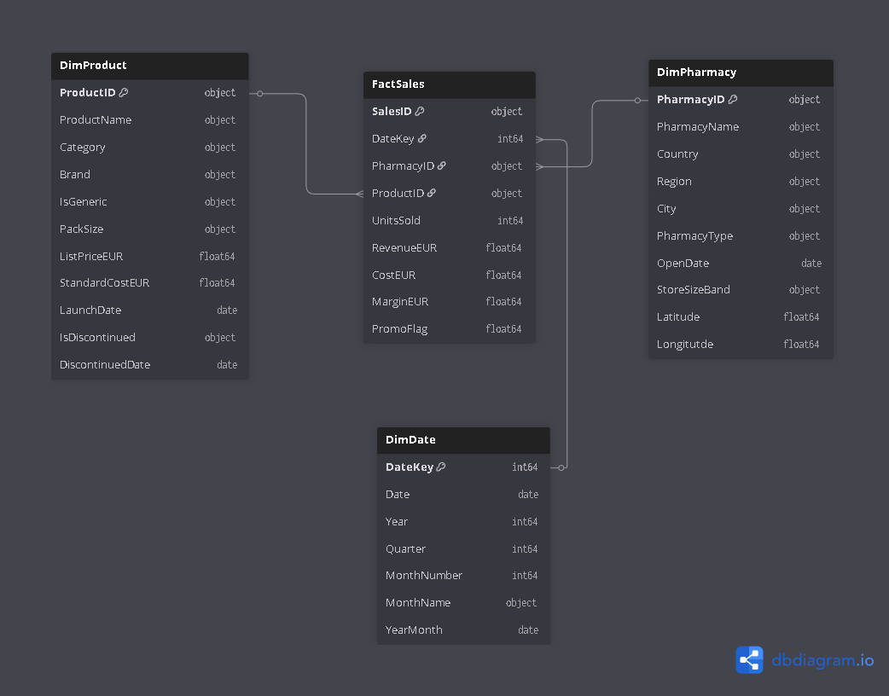

# 💊 European Pharmacy Sales & Profitability Analytics


---

## 📌 Overview

A European pharmacy distributor operates across **8 countries** and **120 pharmacies** — Urban, Suburban, and Rural — managing over **62,000 transactions** across two full years (2024–2025). With multiple product categories, a mix of branded and generic products, and an active promotions programme, the company needed a structured analytical view of what actually drives revenue and where margins are being compressed.

This project delivers that view end-to-end:
- **SQL Server** to model the star schema, explore the data, and answer targeted business questions
- **Power BI** to build an interactive dashboard stakeholders can use to slice performance by country, product, pharmacy type, and promotion status

---

## 🎯 Business Problem

Three core questions drive this analysis:

1. **Where is revenue concentrated** — and are high-revenue locations also the most profitable?
2. **Which product categories justify their shelf space** on margin, not just volume?
3. **Are promotions growing the business** or quietly eroding profitability?

---

## 🗂️ Repository Structure

```
pharmacy-sales-analytics/
│
├── data/
│   └── pharma_data.xlsx              # Raw source dataset (star schema — 4 tables)
│
├── sql/
│   ├── 01_schema_setup.sql           # Database creation, table definitions, indexes
│   ├── 02_kpi_queries.sql            # Revenue, margin, YoY growth, seasonality
│   ├── 03_geo_analysis.sql           # Country, pharmacy type, regional breakdowns
│   ├── 04_product_analysis.sql       # Category, brand, generic, high-vol/low-margin
│   └── 05_promo_analysis.sql         # Promotional impact and margin penalty analysis
│
├── dashboard/
│   ├── pharmacy_dashboard.pbix       # Power BI dashboard file
│   └── screenshots/                  # Dashboard page screenshots
│
├── assets/
│   └── pharmacy_erd.png              # Entity Relationship Diagram
│
└── README.md
```

---

## 🗃️ Dataset

**Source:** OnyxData & ZoomCharts January–February Analytics Challenge

The dataset follows a **star schema** — one fact table joined to three dimension tables.

| Table | Description | Rows |
|---|---|---|
| `FactSales` | Daily transactions — revenue, cost, margin, promo flag | 62,139 |
| `DimPharmacy` | 120 pharmacies with country, region, city, type, size, coordinates | 120 |
| `DimProduct` | 220 products — category, brand, generic flag, list price, cost | 220 |
| `DimDate` | Calendar dimension — year, quarter, month attributes | 731 |

### Entity Relationship Diagram



### Key Fields

| Field | Table | Description |
|---|---|---|
| `RevenueEUR` / `CostEUR` / `MarginEUR` | FactSales | Pre-calculated financials per transaction |
| `PromoFlag` | FactSales | Yes / No — whether the sale was under promotion |
| `PharmacyType` | DimPharmacy | Urban / Suburban / Rural |
| `Category` | DimProduct | Prescription / OTC / Wellness / Personal Care / Medical Devices |
| `IsGeneric` | DimProduct | Branded vs generic product flag |

---

## 🛠️ Tools & Methodology

| Tool | Role |
|---|---|
| **SQL Server** | Schema setup, star schema joins, KPI calculations, segmentation queries |
| **Power BI** | Power Query transformation, DAX measures, interactive dashboard |
| **Excel** | Source data format — imported into SQL Server and Power BI directly |

**Workflow:**
1. Schema design and table creation in SQL Server (`01_schema_setup.sql`)
2. Data import via SSMS Import Wizard (Excel → SQL Server)
3. KPI and segmentation queries across 5 script files
4. Power BI transformation in Power Query — no external dependencies
5. DAX measure for Gross Margin % applied across all visuals
6. Dashboard design with slicers for year, country, pharmacy type, and category

---

## 📊 Key Findings

### Overall Network Performance

| Metric | Value | Notes |
|---|---|---|
| Total Revenue | €8,633,977 | Across 2024–2025 |
| Total Margin | €2,421,141 | 28.0% gross margin |
| Total Units Sold | 445,793 | 62,139 transactions |
| YoY Revenue Growth | +4.4% | €4.22M (2024) → €4.41M (2025) |
| Margin Stability | 28.0% → 28.1% | Consistent across both years |

> **Insight:** The business is growing steadily (+4.4% YoY) while holding margin flat — a sign of disciplined pricing rather than growth at the expense of profitability.

---

### Geographic Performance

| Country | Revenue | Revenue Share | Gross Margin % |
|---|---|---|---|
| Germany | €1,567,634 | 18.2% | 28.0% |
| France | €1,406,812 | 16.3% | 28.0% |
| Italy | €1,332,156 | 15.4% | 28.1% |
| Belgium | €1,246,511 | 14.4% | **28.2%** |
| Netherlands | €947,748 | 11.0% | 28.0% |
| Spain | €735,600 | 8.5% | 27.8% |
| Poland | €714,236 | 8.3% | 28.1% |
| Austria | €683,281 | 7.9% | **28.2%** |

> **Insight:** Germany, France, and Italy account for **49.9% of total revenue**. Belgium has the highest gross margin % (28.2%) despite ranking 4th in revenue — indicating strong unit economics relative to scale.

---

### Pharmacy Type Analysis

| Type | Revenue | Share | Gross Margin % | Avg Revenue/Pharmacy |
|---|---|---|---|---|
| Urban | €4,125,299 | 47.8% | 28.0% | ~€103,133 |
| Suburban | €3,109,296 | 36.0% | 28.1% | ~€77,732 |
| Rural | €1,399,382 | 16.2% | 28.1% | ~€34,985 |

> **Insight:** Urban pharmacies lead on volume but Suburban and Rural match on margin %. The gap is pure volume — once open, smaller-format pharmacies are equally margin-efficient.

---

### Product Category Performance

| Category | Revenue | Share | Gross Margin % |
|---|---|---|---|
| Prescription | €2,797,016 | 32.4% | ⚠️ 21.9% |
| OTC | €1,797,330 | 20.8% | 29.4% |
| Wellness | €1,712,457 | 19.8% | ⭐ 33.6% |
| Personal Care | €1,454,603 | 16.8% | ⭐ 33.5% |
| Medical Devices | €872,572 | 10.1% | 25.0% |

> **Insight:** Prescription is the top revenue category (32.4%) but the lowest-margin (21.9%) — nearly **12 percentage points below Wellness and Personal Care**. Growing the two high-margin categories would have an outsized effect on blended profitability. Every 1% revenue shifted from Prescription to Wellness adds approximately €11,500 to annual margin.

---

### Branded vs Generic

| Type | Revenue | Units | Gross Margin % |
|---|---|---|---|
| Branded | €7,373,586 | 371,106 | 28.5% |
| Generic | €1,260,391 | 74,687 | 25.5% |

> **Insight:** Branded products outsell generics 5:1 in revenue and carry a **3-percentage-point margin advantage**. Generic substitution strategies would compress margins without proportionate volume gains.

---

### Promotional Impact ⚠️

| Sales Type | Revenue | Share | Units | Gross Margin % |
|---|---|---|---|---|
| Non-Promotional | €7,722,676 | 89.4% | 393,608 | **29.0%** |
| Promotional | €911,301 | 10.6% | 52,185 | **19.9%** |

> **Critical Insight:** Promotions represent 10.6% of revenue but carry only a **19.9% gross margin** vs 29.0% for non-promotional sales — a **9.1 percentage point margin penalty**. Every promoted euro of revenue costs the business approximately 9 cents in margin compared to standard pricing. Promotions should be targeted to high-volume, end-of-life stock clearing — not used as a broad demand driver.

---

### High-Volume / Low-Margin Products

| Product | Units Sold | Revenue | Gross Margin % |
|---|---|---|---|
| Medica Cough Syrup 400mg | 3,266 | €52,252 | 24.6% |
| VitaCare Allergy Tabs 400mg | 3,169 | €29,977 | 24.0% |
| AllerFree Cough Syrup 400mg | 3,055 | €24,161 | 23.8% |

> **Insight:** Three products move high volume but underperform on margin — each is a pricing and sourcing optimisation opportunity.

---

### Seasonality

- **Peak months:** July–August and May (consistent across both years)
- **Trough month:** February (lowest revenue both years)
- **Margin stability:** All 24 months fall within a 27.7%–28.5% range — demand fluctuates but pricing discipline holds

---

## 💡 Business Recommendations

| # | Recommendation | Expected Impact |
|---|---|---|
| 1 | Restrict promotions to slow-moving and end-of-life SKUs only | Recover 9.1pp margin on promoted sales volume |
| 2 | Prioritise Wellness and Personal Care category growth (both >33% GM) | Each 1% revenue shift from Prescription to Wellness ≈ +€11,500 annual margin |
| 3 | Review pricing and supplier contracts for top 3 high-volume/low-margin products | Margin improvement across ~9,500 annual units |
| 4 | Focus urban expansion in Germany and Belgium | Highest revenue + margin combination in the network |
| 5 | Investigate suburban pharmacy density opportunities | 36% of revenue at equal margins — potentially better ROI than urban build-out costs |

---

## 🚀 How to Run

### SQL Server

1. Open SQL Server Management Studio (SSMS) and connect to your instance
2. Run `sql/01_schema_setup.sql` to create the database and tables
3. Import data: right-click `PharmacyAnalytics` → Tasks → Import Data → select `pharma_data.xlsx` → map each sheet to its table
4. Run scripts `02` through `05` in order — each is self-contained with comments explaining the business question it answers

### Power BI Dashboard

1. Open `dashboard/pharmacy_dashboard.pbix` in Power BI Desktop
2. If prompted, update the data source path to your local copy of `pharma_data.xlsx`
3. All transformations are in Power Query — no external dependencies required

---


#### Disclaimer
*Dataset sourced from the OnyxData & ZoomCharts Jan–Feb Challenge. Analysis, SQL queries, and Power BI dashboards are original work, adapted for portfolio demonstration purposes.*  
 
